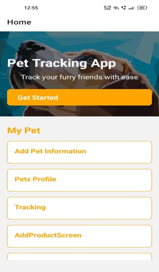
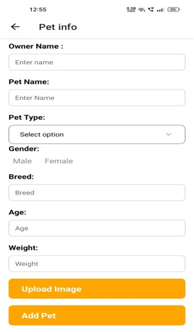
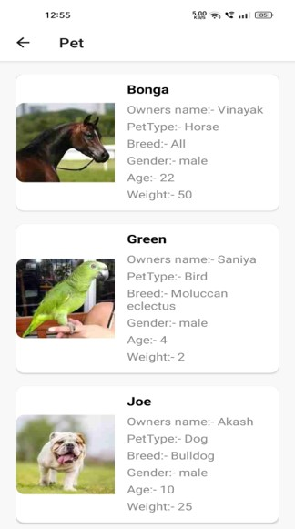
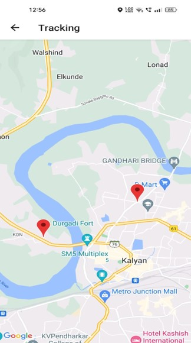

# pet_partner
# AWS Mobile React Native Starter App - Serverless Pet Tracker

**This sample application has been archived in favor of [Amplify JS Samples](https://github.com/aws-amplify/amplify-js-samples).**

This application uses the [AWS Amplify JavaScript library](https://github.com/aws/aws-amplify) to add cloud support to the application.

## Architecture Overview

AWS Services used:
* Amazon Cognito User Pools
* Amazon Cognito Federated Identities
* Amazon API Gateway
* Amazon S3
* AWS Mobile Hub

## Prerequisites
- AWS Account
- [Xcode](https://developer.apple.com/xcode/) / [Android Studio](https://developer.android.com/studio/index.html)
- [Node.js](https://nodejs.org/) with NPM 
  - `npm install -g react-native-cli`
  - `npm install -g create-react-native-app`
- [AWS Mobile CLI](https://github.com/aws/awsmobile-cli)
  - `npm install -g awsmobile-cli`
- (_Optional_) [AWS CLI](https://aws.amazon.com/cli/)  

## Documentation

## Images
     
     

## Error Documentation

## Presentation

## Video

